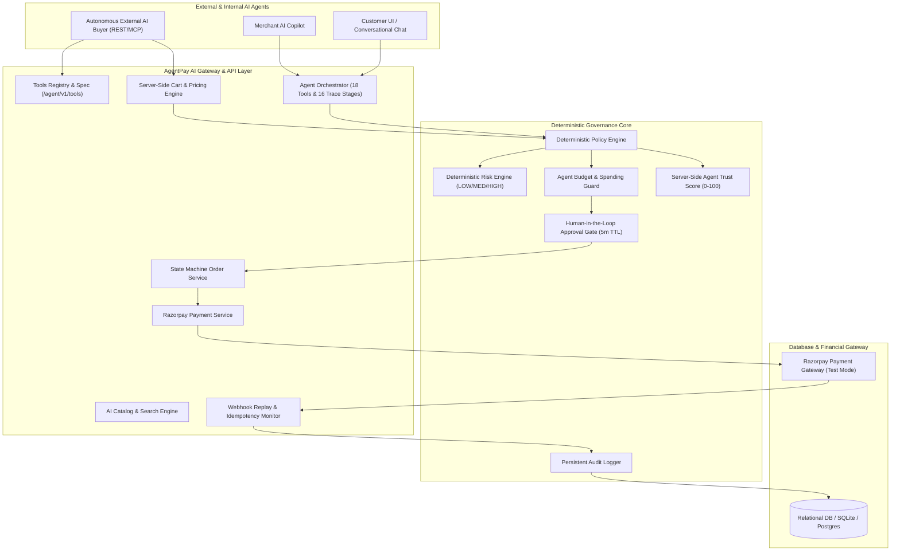
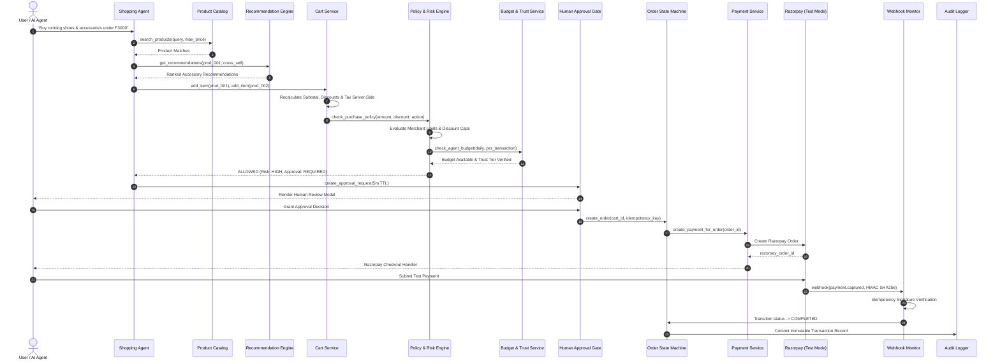
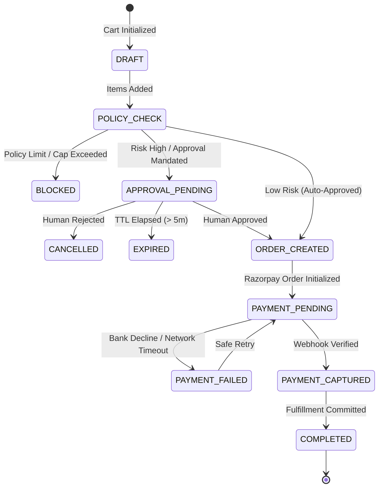

# AgentPay AI — System Architecture & Technical Specifications

AgentPay AI is a production-grade Agentic Commerce platform designed to enable autonomous AI shopping agents, machine-to-machine commerce, algorithmic revenue optimization, and deterministic governance on top of Razorpay Test Mode.

---

## 1. High-Level System Architecture

---

## 2. 16-Stage Autonomous Commerce Pipeline

Every commercial operation undergoes a deterministic, verifiable 16-stage pipeline:

---

## 3. Security & Governance Principles

1. **Deterministic Execution**:
   - Risk scoring and policy evaluations are calculated using pure deterministic algorithms.
   - LLMs have zero ability to execute arbitrary payment API calls or access secret credentials.
2. **Server-Side Price Authority**:
   - Client-submitted totals or unit prices are discarded; all charges are recalculated from active database pricing.
3. **Idempotency & Replay Resistance**:
   - Unique idempotency keys on checkout prevent double charges.
   - Webhook events are hashed and recorded; duplicate webhook delivery is safely ignored.
4. **Time-Limited Human Authorization**:
   - Human approvals strictly expire after a 5-minute TTL. Stale approval tokens are rejected automatically.
5. **Agent Budget & Trust Guardrails**:
   - Agents are bound by daily spending limits and single transaction caps.
   - Trust scores (0–100) adjust dynamically based on transaction success rates, payment failures, and policy violations.

---

## 4. State Machine Lifecycle

